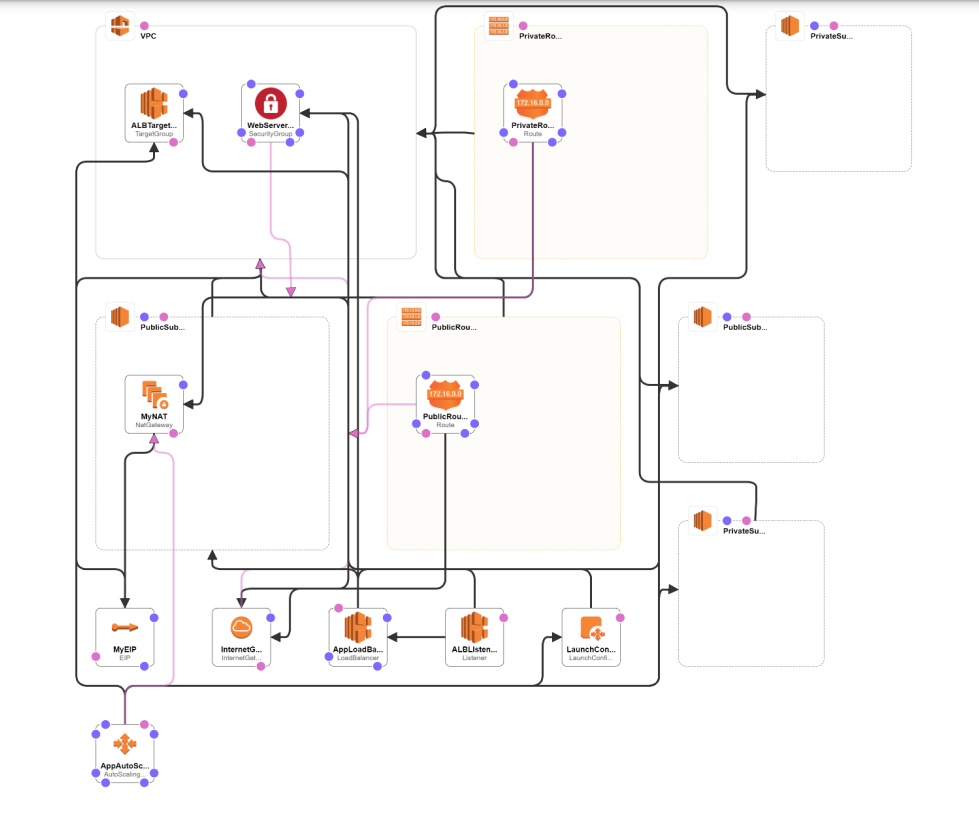

## ABOUT THE PROJECT
The aim of this project is to go through an exercise of writing a CloudFormation template for below architected application. In this exercise, I learned the following:
* Writing a template structure
* Parameterize the CF template
* Mapping values
* Writing resource blocks
* Outputs to be used within CF and passing values to other stacks

## ARCHITECTURE

## PROCEDURE:
* Using the VS Code, create a stack with the provided code and launch AWS resources
* Verify the code output using the CloudFormation Designer and confirm with above architecture of the application

## REFERENCES
* To view all the supported AWS resources and their properties, see the [Template Reference](https://docs.aws.amazon.com/AWSCloudFormation/latest/UserGuide/template-reference.html)
